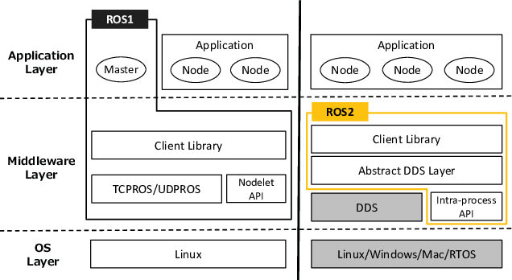

# ROS2 에 대한 개념과 공부에 대한 정리 Repo
---
## 목 차

[1. ROS1 과 ROS2의 차이점 비교](#1-ros-1-과-ros-2-의-차이점-비교)  
[2. ROS 1 과 ROS 2 는 통신이 가능한가?](#2-ros-1-과-ros-2-는-통신이-가능한가)  
[3. ROS 2 는 ROS 1 의 한계를 극복하기위해 만들어 진다](#3-ros-2-는-ros-1-의-한계를-극복하기위해-만들어-진다)  
[4. ROS 2 와 그 이전의 개념 탑재하기](#4-ros-2-와-그-이전의-개념-탑재하기)  

## 1. ROS 1 과 ROS 2 의 차이점 비교

### 아키텍쳐 비교


| 비교 | ROS 1 | ROS 2 |
| :--------: | :--------: | :--------: | 
|`Application layer` | 항상 ROS Master가 필요  [ roscore 실행] | DDS 기반 미들웨어안에서만 동작  [roscore 안해] | 
|`Middleware Layer`| 사용자 정의 위주의 중앙 메커니즘| 추상 미들웨어 인터페이스 | 
|`지원 OS`|리눅스만 지원| 리눅스/윈도우/맥/ 기타 RTOS 등..| 
|`지원 언어`|Python2 & C++ 11| Python3 & C++ 14,17| 
|`다중 Node(프로그램)의 지원 여부`|한 프로세스에 한 노드만 지원| 한 프로세스에 다중 노드 지원| 
|`roslaunch의 동작 메커니즘`|Xml 기반의 제한된 구조의 실행(은근 빡침)| 복잡한 실행을 Python으로 간편하게|


#### 1. Application Layer

##### - ROS 1 의 통신 방식


    기존의 ROS1에서는 'roscore' 라는 별도의 마스터를 두고 통신을 진행하였다. 
    이 마스터는 중개자로서 각종 노드에서 발생하는 Publisher 와 Subscriber 사이에서 일어나는 통신을 중재하였는데 이런 통신에서 XMLRPC(Xml Remote Procedure Call)을 사용하여 상호작용 하였다.
    'roscore' 명령어를 실행 할 경우 roscore.xml 을 포함하는 launch file을 실행하는데, 해당 xml 안에 내 ROS_MASTER_URI 주소를 사용해 rosmaster가 받아 들일 IP주소 및 PORT를 사용해 마스터를 관리 및 사용한다.
    여기서 마스터와 슬레이브는 토픽,서비스,액션립의 방식을 활용해 서로 통신을 진행하였었다.
| 통신 이름 | 동기/비동기 | 방향 | 특징 | 부연 |
| :--------: | :--------: | :--------: | :--------: | :--------: |
|`Topic` | 비동기 | 단방향 | 연속 데이터 수신 용 | 1:1 , 1:N , N:N| 
|`Service`| 동기 | 양방향 | 요청 처리가 일시적인 현재 상태에 대한 요청 및 응답 | Request / Response | 
|`Action`| 비동기 | 양방향 |요청 처리 후 피드백이 오래 걸리거나 중간 피드백이 필요한 경우 | Goal / FeedBack / Result |

##### - ROS 2의 통신방식  
ROS2의 경우 DDS(Data Distribution Service)라는 통신방식을 활용하여 기존의 통신방식을 개선하였다.  
도데체 DDS가 뭔데 ROS2에서 이를 도입하였을까? 이 DDS 통신에 대해서만 제대로 이해 해도 일단 ROS1 과 ROS2의 차이는 절반을 이해했다고 해도 된다. 
우선 이 통신 표준을 설립한 OMG(Object Management Group)에 대해서 알아보자
  


#### OMG (Object Management Group)  
OMG는 1989년 4월 HP, SUN 등 11개 업체에 의해 발족된 OMG는 이러한 표준화를 선두에서 이끌고 있는 조직으로 현재 전 세계 800여 개 이상의 회사가 소속된 컨소시엄 형태의 비영리단체이다.   

주로 정보기술 환경에 관련 된 표준화를 수립하는 일을 하고있으며, MOF,UML,XMI 등의 객체 관리 표준 모델을 제시하고 전파하고있다.

그리고 이 기관에서 최근에 제시한 객체 모델이 바로 DDS이다.

#### 그래서 DDS(Data Distribution Service) 가 뭔데?  
DDS는 기존 클라이언트 - 서버 기반의 노드간 상호 동작을 중심이 아니라 노드 상호간 공유/교환 되어야 할 데이터 자체에 중심을 둔 데이터 배포 메커니즘이라고 __ETRI__ 에 기술되어 있다. 간단히 말하자면 원래 통신을 할 때는 서버랑 클라이언트 끼리 해야 되는게 맞지만, 워낙 시대가 좋아져서 기기들마다 통신이 되다보니 모두 연결하기엔 HW가 후달린다. 또, 즉각 대응이라는(실시간) 부담 역시 안고가야하는 통신이 요구되면서, 이런 통신 풀을 가운데(미들웨어)에서 관리하고(스케쥴링) 신뢰도를 높여(Qos) 통신 할 순 없을 까 하고 나온게 DDS란 말씀. 이로 인해 Domain ID만 가지고 통신이 되기에 Socket 이 필요없이 통신을 할 수 있게 되었다.
  
그러다 보니 자연스럽게 DDS 통신이 놓이는 포지션은 하기와 같이 쓰이게 된다.


__즉, DDS는 다양한 통신 객체들의 대량 데이터를 관리하는 통신 미들웨어__ 라고 볼 수 있다.
DDS 개념은 네트워크프로그래밍 영역이라 ROS 자체에서 뭔가 깊게 설명하기 그렇다. 사실 ROS는 종합 예술적 오픈소스 프로젝트로 어느 한분야를 깊게 들어가면 끝도 없다. 수많은 전문가들이 만든 이 아름다운 도구를 우리는 이렇게 손쉽게 사용하고 있는것이다.  

DDS와 경쟁을 하는 통신으로는 CORBA,JMS 의 P2P 통신방식이 있다. 이건 검색을 통해 독자들이 직접 찾아 이해 했으면 하는 마음이다.

자, 이제 DDS가 뭔지는 알겠다. OMG라는 기관에서 만들었고 미들웨어라는 사실, 그래서 왜 이걸 쓰는데? 라고 물어 볼 수 있을것이다.

앞에서 살짝 언급했었지만 이를 좀더 구체적으로 설명 하기 위해 다시 앞서 이야기 했던 내용을 언급하고자 한다. 

#### 왜 DDS를 쓰는건데?  
우리는 바야흐로 `4차 산업혁명`의 시대에 살고있다. `4차 산업혁명`이 무엇인가? 모든 디바이스의 커넥션과 통신속도의 진화, 대용량 데이터의 부상, 인공지능 알고리즘의 혁신, 이를 받쳐주는 HW의 격변을 이야기 할 수 있을것이다. 이런 복잡한 통신디바이스가 대량으로 연결되고 관리되기 위해서는 통신 시스템의 고도화가 진행되기 마련이고 시스템 구조 역시 엄청나게 복잡해 진다. HW 개량 뿐 아니라 소프트웨어 개발 공수도 몇배로 늘어나게 된다. 이러면 시스템 아키텍쳐를 설계하는 설계자 입장에서 모든것을 간단히, 간편하게 설계하고 싶은 열망을 누구나 가지게 될것이다. 왜? 내가 편하려고!

DDS로 넘어오는것은 ROS1에서 시작햇던 `연구자 및 개발자`를 목적으로 개발했던 초기와는 달리 `필드에서 직접 운용 가능한 ROS`를 지향하는 것이라 볼 수있다.

필자는 생산기술 필드에서 설비제작을 진행 하면서 1%의 불량도 용납하지 않는 생산필드를 충족 시킬 설비를 제작해야됬는데, 이러한 요구를 위해서는 멈춤,지연 이란 있을 수 없고 철저히 빠르게 동작을 수행 하는 설비만이 유효한 라인에 투입될 수있음을 몸소 체험했다.  

웃자고 하는 말이지만 열약하기 짝이없는 중소기업에서 모터제어 같은건 고려대상에 포함도 안되있고 그냥 공압시스템 설계로 모션동작은 퉁치는 경우가 허다하다. 싼맛에 최적화 해서 쓰는 필드이다 보니, 조금이라도 주변환경이 변하거나 문제가 생기면 참 답없이 관리되거나 버려지는일도 허다하다.  

여하튼 ROS2의 요구에 화답이라도 하듯 DDS는 국방,빌딩,산업용 통신 방식에 쓰일 목적으로 개발되었다. 애초에 QoS(Quality of Service) 통신, Secure Realtime 통신 등만 보아도 통신의 품질 및 안정성에 주안을 두고 Node간 통신을 수행 하도록 만들었구나를 알 수 있다.

따라서 DDS 통신의 특징은 하기와 같이 기술될 수 있다.  

- 발간/구독(Publish/Subscribe) 통신 방식 : 데이터 중심적인 통신이 가능하며, 방대한 양의 데이터 전송과 처리에 적합

-  자동 디스커버리(discovery) 기능 : 시스템의 동적인 구성 변화에 자동 대응

-  일정 시간 내(deterministic) 데이터 전송 기능 : 실시간 데이터 전송 기능
-  다양한 통신 방식 : 일대일(one-to-one), 일대다(one-to-many), 다대일(many-to-one), 다대다(many-to-many) 통신 지원
-  다양하고 상세한 메시지 전송 제어용 QoS(Quality of Service) 파라미터 제공 : 시스템 목적에 따른 다양한 데이터 전달 정책을 선택 적용 가능

##### 1. 발간 / 구독 통신방식


### ROS 2 의 명령어 특징
 - ros2 node list
   - 실행 중인 ROS 2 환경에 node 목록 호출
 - ros2 node info `/실행중인 node`
   - 실행 중인 Node 의 정보 확인
#### Node info
 - Subscribers : 메세지 발행자 목록 [ 토픽 통신 : 단방향 메세지 통신 ]
 - Publishers : 메세지 구독자 목록  [ 토픽 통신 : 단방향 메세지 통신 ]
 - Service Servers : 서비스 서버 정보 [ 양방향 통신 : req / res ]
   - DescribeParameters
   - GetParameterTypes
   - ListParameters
   - SetParametersAtomically
 - Service Clients : 서비스 클라이언트 [ 양방향 통신 : req / res ]
 - Action Servers : 액션 서버 [ 양방향 통신 : goal / result / feedback ] 
 - Action Clients : 액션 클라이언트 [ 양방향 통신 : goal / result / feedback ]


        이와 같이 ROS 1 에서 사용했던 명령어와 동일하나 앞에 ` 2 ` 를 붙여 실행하는 것이 특징

## 2. ROS 1 과 ROS 2 는 통신이 가능한가?

ROS1 시절 부터 수많은 패키지 들이 개발되어왔다. 이러한 ROS 1 전용 툴을 ROS 2 에서 재개발 하는것이 아닌 재사용을 하기위하여, ROS 2에서는 Bridge node를 활용해 ROS 1에서 사용 되어온 패키지를 재사용 해 재개발의 번거로움을 극복하였다.

ROS1 과 ROS2 두 메타운영체제 간의 통신을 위해서는 별도의 세팅이 필요로 되어진다.

    ros1_bridge node

`ros1_bridge node` 는 ROS1 과 ROS2간의 통신을 위해 만들어진 노드이다.  
사용방법은 ROS 1 에서 Publish 되고있는 msg가 있을때, ROS 2 에서 해당 메세지를 받고 싶을 경우 `ros2 run ros1_bridge '브릿지 명'` 을 통해 받도록 한다.

__※ 이때, 사용자는 ROS1 과 ROS2가 동일한 ROS_MASTER_URI 를 사용하고 있어야 한다.__

## 3. 'ROS 2' 는 'ROS 1' 의 한계를 극복하기위해 만들어 진다

ROS2가 나오기 전 필자가 두대 이상의 로봇을 한 공간에 시뮬레이션을 굴리려고 하면 여간 골치아픈 작업이 아닐 수가 없었다.

`Gazebo`에 두대 이상의 시뮬레이션을 넣고싶어 ROS 1 으로 환경을 구축할 때, 이용 해야했던 xml,yaml,launch 구조는 일반적인 방법으로  ROS Developer 들이 하기에는 매우 적합하지 못했다. `<group>` 태그 안에서 `tf_prefix` 를 생성해 별도의 link,joint 그룹을 생성하고 동작에 대한 별도의 node 를 형성 해 실행하는데 있어 그리고 두개 이상의 rviz를 moveit 으로 병행해 Python으로 동작시키는것은 상당히 번거롭다.


    두대의 6축 로봇을 `Gazebo` 안에서 두개의 Rviz로 제어하는 모습


   
    두대 이상의 로봇은 보다 복잡한 tf map을 그린다.


    두대 이상의 로봇의 node는 group 내에서 더 복잡하게 얽혀있다.

이러한 형태의 번거로운 구조를 ROS2에서는 보다 간편하고 쉽게 풀어나가는 모습을 보여준다.

# 4. ROS 2 와 그 이전의 개념 탑재하기
ROS 1 시절부터 배워왔던 개념을 다시 정립하고자 해당 내용을 보충하고자 한다. 

#### ROS 에서 pkg 란 무엇인가?

__ROS에서 패키지란 ?__ 

cpp 파일, python 파일, configuration 파일, compilation 파일, launch 파일, and parameters 파일을 종합적으로 묶어 놓은 도구를 일컫는다. 패키지에 대한 추상적 개념부터 특징에 대해 말하자면 다음과 같다.

    1. 모든 ROS 프로그램은 패키지로 구성된다.
    2. 당신이 만드는 모든 ROS 프로그램은 패키지로 구성되야 한다.
    3. 패키지는 ROS 프로그램의 주요 시스템이다.

패키지는 직접 `catkin_create_pkg` 명령어를 통해 직접 만들 수 도 있으며, 또는 직접 패키지를 설치하여 관리 할 수 있다.

설치된 패키지들은 `/opt/ros/groovy/share/` 의 경로에서 관리되며 생성된 패키지가 없을 경우 사용이 불가하다. 

    대표적인 pkg 중 하나인 'MoveIt! Setup Assistant'


ROS에서 패키지를 생성한 경우 다음과 같은 디렉터리 구조를 만들 수 있다.

  

    config 폴더 : ROS 패키지에서 사용하는 모든 환경 설정 파일들을 보관
    scripts 폴더 :실행 가능한 python script를 보관
    action 폴더 : action 정의를 포함해 보관
    srv 폴더 : 서비스 정의를 포함해 보관
    msg 폴더 : 맞춤형 메세지 정의를 포함해 보관
    launch 폴더 : launch files을 보관하는 장소 (하나 이상의 node를 실행하기위해)
    src 폴더 : 실행 가능한 Cpp file을 보관하는 장소
    CMakeLists.txt : CMake 빌드환경에 대한 기술
    package.xml : 패키지 정보가 담긴 xml 구조의 파일

해당 디렉토리 이외에도 개발자들 사이에서 control 폴더, config 폴더[configuration],urdf 폴더 등으로 구조를 지니고 있으며, 큰 단위의 로봇 프로젝트를 진행 할 때

1. 로봇이름_description : 로봇 모델에 대한 상세 기술
2. 로봇이름_controller : 로봇 동작을 위한 상세 기술
3. 로봇이름_gazebo : gazebo 내 모델에 대한 기술
4. 로봇이름_hw_interface : 로봇 자체의 hw interface를 위한 pkg
5. 로봇이름_drvier : 4번과 동일
6. 로봇이름_moveit_config : moveit으로 생성한 pkg

등의 형태로 로봇 패키지를 관리하는 작명센스를 보이고있다. 이와 관련된 내용은 프로젝트 진행자 마다 다르므로 건너뛰기로 한다. 필자는 독일에 kuka, ur로봇, 국내 indy series, robotis의 manipulator 에 대한 프로젝트 진행자들이 짠 구조에 대한 내용을 참조함을 이해 바란다.

자, 앞서 이야기 했던 긴 이야기는 ROS 1 이라는 거대한 맥락의 일부이나, 우리는 `ROS2` 를 배우고 있다. 그렇다면 기존에 `launch` 를 통해 실행되었던 우리의 `pkg`는 지금 어떤 식으로 관리 되고 있을까 ?

[아키텍쳐 비교](#아키텍쳐-비교) 에서 설명했듯 `xml` 형태로 실행 되었던 우리의 분노게이지를 올렸던 ROS1의 pkg 관리 방식은 `python`으로 대체되었다. 그 차이를 아래 글에서 설명하고자 한다.

ROS1 시절 실행되었던 `xml` 형태의 실행 `File`

    <launch>
        <arg name="매개변수 설정" doc="매개변수에 대한 설명" default="입력 없을때 설정할 값" />
        <param name="파라미터 이름" type="타입(자료형)" value="$(arg 매개변수)"/>
        <node name="실행할 node 이름" type="실행할 프로그램.py or 실행할 프로그램.cpp" pkg="패키지 이름" />
    </launch>

ROS 1에서는 이런 형태로 `launch`에 쌈싸먹듯 프로그램을 굴려야 했다면

ROS2에서는 `python`으로 굴린다.

```python
from launch import LaunchDescription
import launch_ros.actions

def generate_launch_description():
    return LaunchDescription([
        launch_ros.actions.Node(
            package='패키지 이름', node_executable='실행 할 cpp 이름', output='터미널에 뿌릴지 로그파일로 남길지 등을 선택'),
    ])
```
해당 py 프로그램을 생성한 뒤

CMake.txt file 내에 아래 내용의 코드를 추가해 준다. 
```
install(DIRECTORY
  launch
  DESTINATION share/${PROJECT_NAME}/
)
```

아까 위 글에서 설명하였듯, 모든 pkg는 opt/ros/share 에서 관리되고 있다. 해당 프로젝트를 추가함으로서 CMake build 환경을 구성한다.

그다음 `catkin_build --symlink-install` 명령어를 입력해 빌드 후 `ros2 launch 패키지 이름 패키지 실행파일.py` 하면 정상적으로 ROS1에서 패키지 launch 하는 것과 동일한 실행을 진행 할 수 있다.

이런식으로 우리는 기존 ROS1 과 다른 형태의 실행방식에 적응해야된다. ROS2 에는 다양한 언어를 지원하기 위한 Ros Client library(RCL) 을 지원한다. 다양한 언어로 생성된 node 들을 실행 하기위해 ROS2 에 유지보수 팀이 직접 RCL을 관리하고 있다. 

아래 라이브러리는 ROS2 팀에서 관리하는 RCL 이다.
   
    rclcpp = C++ 클라이언트 라이브러리
    rclpy = Python 클라이언트 라이브러리


 
  
   
    
    